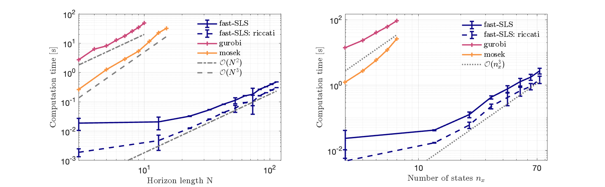

# Fast System Level Synthesis: Robust Model Predictive Control using Riccati Recursions
This repository contains the MATLAB code that accompanies the research paper:
> Leeman, Antoine P and Kohler, Johannes and Messerer, Florian and Lahr, Amon and Diehl, Moritz and Zeilinger, Melanie N “Fast System Level Synthesis: Robust Model Predictive Control using Riccati Recursions” 
> arXiv preprint arXiv:2401.13762, 2024.



The paper is freely available on [arXiv](https://arxiv.org/abs/2401.13762) 

## Prerequisites
- MATLAB (tested with version R2023b running on Macbook Pro with M1 processor with 8 cores and 16GB of RAM running macOS Sonoma)
- Casadi (tested with casadi-3.6.4-osx_arm64-matlab2018b )

Only for performance comparison:
- Yalmip (tested with Version 22-June-2023)
- Mosek (tested with Version 10.3)
- Gurobi (tested with Version 10.0.3)

## Installation
1. Download and install MATLAB from the [official website](https://www.mathworks.com/products/matlab.html).

2. Install Casadi by following the instructions from the [official Casadi documentation](https://web.casadi.org/get/).
    
3. (optionnal) If you want to run the comparisons
- Install [Yalmip](https://yalmip.github.io/tutorial/installation/)
- Download MOSEK, (request a license), and add it to your matlab path

          addpath('C:/Users/Documents/mosek/10.3/toolbox/r2022b/mosekopt.mexmaca64'); % Adjust this path to your MOSEK installation
          savepath; % Save the updated path for future MATLAB sessions

- Downlaod Gurobi, (request a license), and add it to your matlab path

          addpath('C:/Users/gurobi/macos_universal2/'); % Adjust this path to your Gurobi installation
          savepath; % Save the updated path for future MATLAB sessions

4. Clone this repository or download the code as a ZIP archive and extract it to a folder of your choice.

5. Add the code folder to your MATLAB path by running the following command in the MATLAB Command Window:
    
        addpath('/path/to/your/code/folder');
    
## Usage

Run the main script (i.e., main.m) to execute the algorithms and models discussed in the paper.

## License

This project is licensed under the MIT License.

## Citation

If you use this code in your research, please cite our paper:
  ```
@article{leeman2024fast,
  title={Fast System Level Synthesis: Robust Model Predictive Control using Riccati Recursions},
  author={Leeman, Antoine P and K{\"o}hler, Johannes and Messerer, Florian and Lahr, Amon and Diehl, Moritz and Zeilinger, Melanie N},
  journal={arXiv preprint arXiv:2401.13762},
  year={2024}
}
  ```
  
## Support and Contact

For any questions or issues related to this code, please contact the author:

- Antoine Leeman: aleeman(at)ethz(dot)ch

We appreciate any feedback, bug reports, or suggestions for improvements.